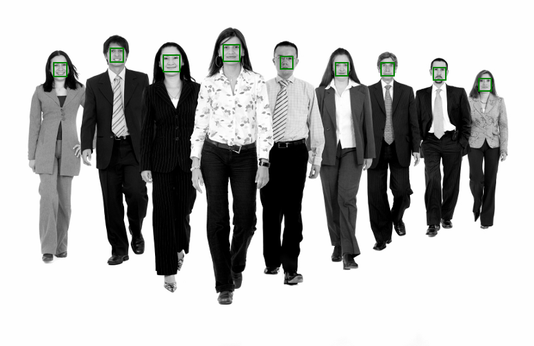
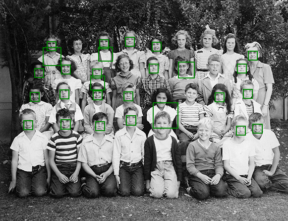
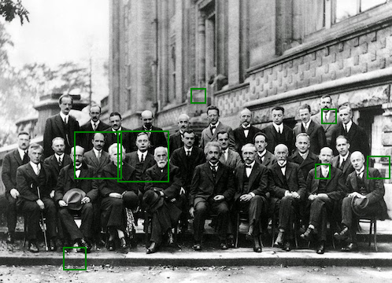
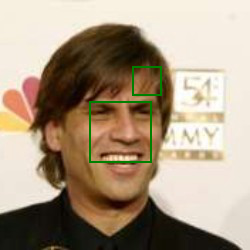
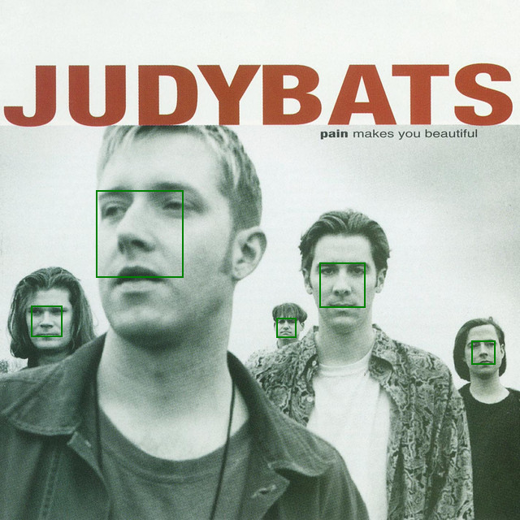
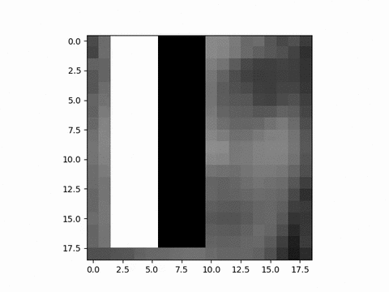

# Viola-Jones

Educational Python implementation of the face-detection algorithm from
_Rapid Object Detection using a Boosted Cascade of Simple Features_
(Paul Viola & Michael J. Jones, 2001).

The pipeline:

1. **Haar-like features** enumerated over a 19×19 window
2. **Integral image** for O(1) rectangle sums
3. **AdaBoost** to pick a small set of strong weak classifiers
4. **Attentional cascade** of AdaBoosts with hard-negative mining

## Install

```bash
pip install -r requirements.txt
```

## Dataset

Training and evaluation use the [MIT CBCL Face Database #1](http://cbcl.mit.edu/software-datasets/FaceData2.html):
2 429 / 4 548 train and 472 / 23 573 test 19×19 grayscale faces / non-faces.
A bundled copy ships in `datasets/mitcbcl.zip`.

```bash
unzip datasets/mitcbcl.zip -d ~/Desktop/mitcbcl
```

The loader (`utils.load_cbcl_dataset`) accepts either the raw PGM directory
layout (`<split>/face/*.pgm`, `<split>/non-face/*.pgm`) or pre-bundled
`.npy` files at the root of the dataset directory. On first read of the
PGM layout it caches `.npy` bundles next to them so subsequent runs are
instant.

## Run

The script is driven by a positional `mode` argument plus optional flags:

```bash
python main.py <mode> [options]
```

| Mode      | What happens |
|-----------|--------------|
| `train`   | Fits the cascade and pickles a checkpoint to `weights/<test-size>/cvj_weights_*.pkl`. Does **not** evaluate — run `test` afterwards for that. |
| `test`    | Loads a checkpoint (or the latest one if `--weights-path` is omitted) and prints metrics on the full CBCL train and test splits. |
| `detect`  | Loads a checkpoint, runs sliding-window inference on `--detect-images`, and writes annotated PNGs to `--detect-output`. |

### Examples

```bash
# Train (paper-style, full dataset, with data augmentation and bootstrap pool)
python main.py train \
    --dataset-path ~/Desktop/mitcbcl \
    --neg-pool-path ~/Desktop/mitcbcl/bootstrap_negatives_19x19g.npy \
    --caltech-path ~/Desktop/256_ObjectCategories \
    --layers 1 10 50 100 \
    --layer-recall 0.99 \
    --data-augment

# Quick smoke run (subsample 200 samples, 2 stages)
python main.py train --dataset-path ~/Desktop/mitcbcl --test-size 200 --layers 5 10

# Evaluate metrics on train/test splits (auto-pick latest checkpoint)
python main.py test --dataset-path ~/Desktop/mitcbcl

# Detect faces in images (auto-pick latest checkpoint)
python main.py detect --detect-images images/people.png images/clase.png

# Full help
python main.py --help
```

### Training flags

| Flag | Default | Description |
|------|---------|-------------|
| `--dataset-path` | *(required)* | Path to the CBCL dataset root |
| `--test-size N\|all` | `all` | Subsample training set to N samples, or `all` for the full 6 977-sample split |
| `--layers T [T ...]` | `1 10 50 100` | Weak learners per cascade stage |
| `--data-augment` / `--no-data-augment` | on | Mirror faces horizontally (~doubles the positive class) |
| `--layer-recall` | `0.99` | Per-stage face-recall target; cumulative recall ≈ `layer-recall ^ N` |
| `--neg-pool-path` | — | Path to prebuilt bootstrap negative pool (`.npy`). Built from `--caltech-path` if missing. |
| `--caltech-path` | — | Caltech-256 directory, used to build the bootstrap pool when it does not exist yet |
| `--target-neg-per-stage` | `3000` | Negatives mined from the pool per cascade stage |
| `--neg-sample-budget` | `100000` | Max patches sampled per stage when mining |

### Eval / detection flags

| Flag | Default | Description |
|------|---------|-------------|
| `--weights-path` | auto | Checkpoint to load; omit to auto-pick the most recent one under `weights/` |
| `--detect-images IMG [IMG ...]` | bundled samples | Images to run face detection on |
| `--detect-output` | `images/outputs` | Directory where annotated output PNGs are saved |

`draw_features()` (renders an animation of the selected Haar features on a
face image — used to make `images/outputs/output.gif`) lives in `main.py` as
a standalone function; call it from a Python REPL if needed.

Cost notes: training is roughly linear in samples × features × Σ`LAYERS`,
with an extra 3 000-negative mining pass per stage from the bootstrap pool.
On a MacBook Pro M1 (single-threaded Python), the paper-style
`[1, 10, 50, 100]` on the full set with augmentation takes ~2 h 30 min;
`[5, 10]` with `--test-size 200 --no-data-augment` takes ~10 min and is
enough to sanity-check the training loop.

## Results

Runs on a MacBook Pro M1 (single-threaded Python). Train/test metrics are
always on the **full** 6 977 / 24 045 CBCL splits:

| Setup                                                   |  Train F1 | Train acc. | Test F1 | Test acc. | Test precision | Test recall | Time |
|---------------------------------------------------------|----------:|-----------:|--------:|----------:|---------------:|------------:|-----:|
| `TEST_SIZE=200`,  `LAYERS=[5, 10]`                      | 0.847 | 0.904 | 0.306 | 0.963 | 0.243 | 0.411 | ~10 min |
| `TEST_SIZE=1000`, `LAYERS=[2, 10, 30]`                  | 0.830 | 0.860 | 0.097 | 0.694 | 0.052 | 0.839 | ~28 min |
| `TEST_SIZE="all"`, `LAYERS=[1, 10, 50, 100]` (bootstrap + var-norm + held-out cal. + aug) | **0.957** | **0.969** | **0.375** | 0.958 | **0.265** | **0.642** | ~2 h 30 min |

The last row is the current default. Three complementary techniques drive
the test-set numbers:

1. **Hard-negative mining from Caltech-256** (`build_bootstrap_negatives`
   in [utils.py](utils.py)): each cascade stage trains on 3 000 fresh false
   positives mined from ~600 k face-free patches rather than exhausting the
   4 548 CBCL non-faces by stage 4. The pool is built once and cached at
   `bootstrap_negatives_19x19g.npy`. Train precision is no longer
   artificially perfect (0.930 with FP=181) because the cascade can't just
   memorize the tiny CBCL non-face pool.
2. **Per-window variance normalization** (Viola-Jones §5.1): each training
   sample's feature row is divided by its pixel std before AdaBoost sees
   it; at inference `WeakClassifier.classify` multiplies the threshold back
   by the window's std ([weakclassifier.py](weakclassifier.py)). This
   reduces false positives on high-contrast background regions.
3. **Held-out calibration**: 15 % of training positives are reserved for
   calibrating `LAYER_RECALL=0.99` per stage ([violajones.py](violajones.py)).
   Fitting the threshold on the same positives the weak classifiers were
   optimized on overstates recall — calibrating on unseen faces gives
   thresholds that transfer better.

### Why test metrics look much worse than train

- **Prevalence shift.** Train ratio faces : non-faces ≈ 1 : 1.9; test ≈
  1 : 50 (472 / 23 573). At a test FPR of just 3.6 %, FPs (839) still
  outnumber TPs (303) — precision is fundamentally capped by the class
  imbalance and will only rise by reducing FPR further.
- **Distribution gap.** CBCL training faces are tightly cropped and
  normalized 19×19 images. CBCL test faces differ in illumination,
  partial occlusion, and background — the cascade still generalises
  imperfectly across this gap.
- **Limited cascade depth.** The paper uses 38 stages with thousands of
  weak classifiers; this implementation uses 4 stages and 161 total WCs.
  More stages trained on a richer negative pool would push FPR lower
  without hurting recall.

## Example detections

Run with the bootstrap + variance-norm checkpoint (`TEST_SIZE="all"`,
`LAYERS=[1, 10, 50, 100]`, `DATA_AUGMENT=True`, Caltech-256 bootstrap pool),
sliding window starting at 19×19 and growing 1.25× per pass with `shift=2`,
post-processed with NMS @ IoU 0.3.

| Image           | Raw windows ⇒ post-NMS | Detection PNG |
|-----------------|------------------------|---------------|
| `people.png`    |    146 ⇒ 26 |      |
| `clase.png`     |    694 ⇒ 49 |        |
| `physics.jpg`   |    490 ⇒ 44 |    |
| `i1.jpg`        |    154 ⇒  5 |              |
| `judybats.jpg`  |  1 495 ⇒ 45 |  |

Variance normalization suppresses high-contrast non-face regions before
they ever reach the cascade, so raw candidate counts stay manageable
(`people.png`: 146, `i1.jpg`: 154) and most "noisy" images (`clase.png`,
`physics.jpg`, `judybats.jpg`) still resolve to a few dozen boxes after
NMS — consistent with the cascade's 0.642 test recall.

## Animation of the selected Haar features


