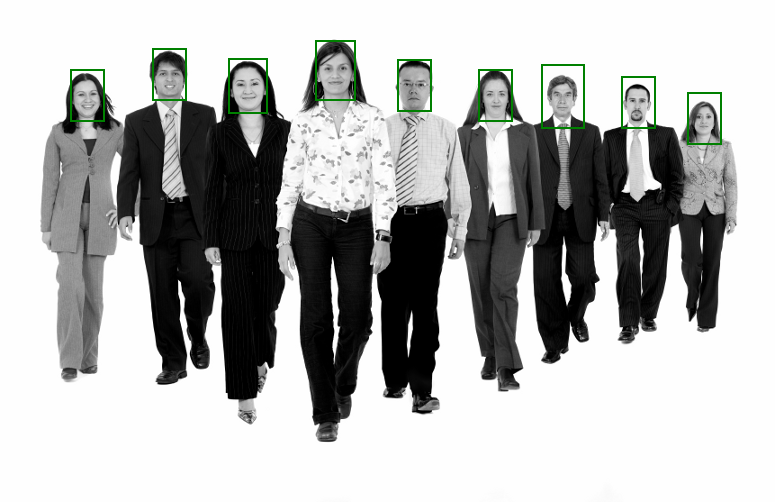
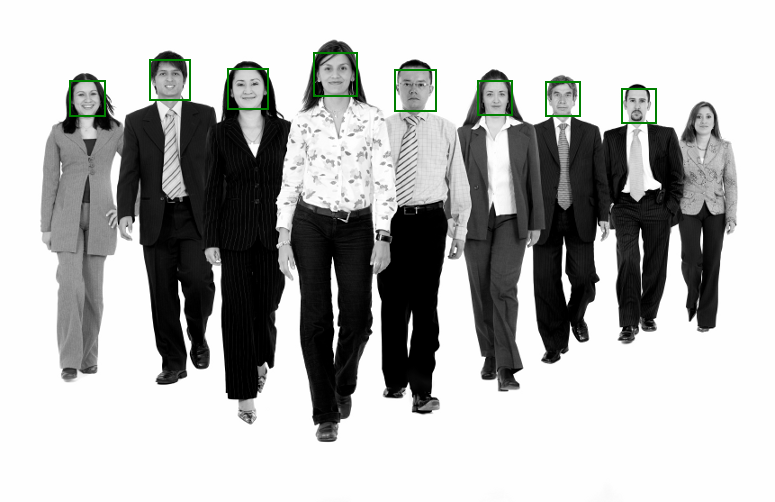
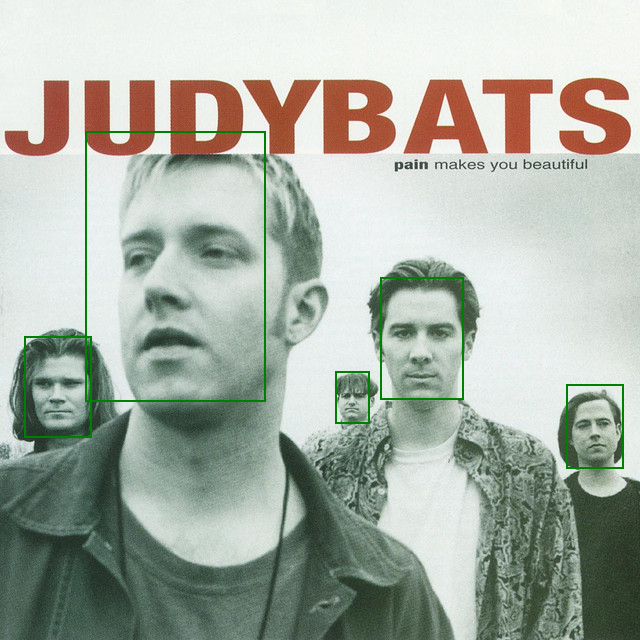
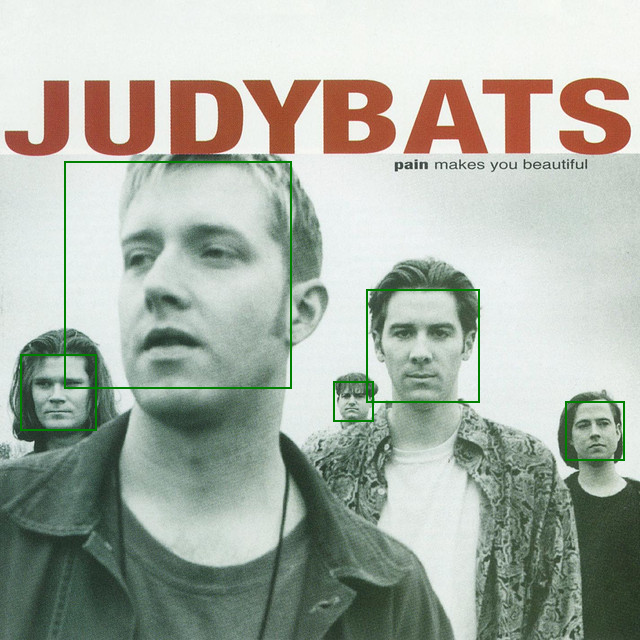
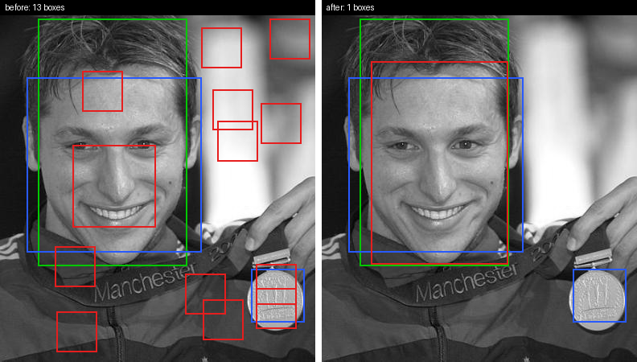

# Viola-Jones face detector

From-scratch NumPy implementation of [Viola & Jones (2001)](https://doi.org/10.1109/CVPR.2001.990517): Haar-like features, integral image, AdaBoost, and an attentional cascade with hard-negative mining. The detector itself uses no OpenCV.

| Ours (`weights/24/celeba.pkl`) | OpenCV `haarcascade_frontalface_default` |
| :-: | :-: |
|  |  |
|  |  |

## Highlights

- **Pure NumPy**, every piece built from scratch: integral image, Haar features, AdaBoost stumps, cascade, multi-scale sliding window, NMS.
- **Adaptive trainer** (paper §3): stage depth and weak-classifier count emerge from a two-condition early-stop, not from hard-coded sizes.
- **Vectorized inference**: image pyramid with one integral image per scale; the whole cascade runs as a batched NumPy reduction over surviving windows.
- **Honest benchmarking**: CBCL patches plus in-the-wild FDDB, with [OpenCV's cascades as an external baseline](docs/OPENCV_COMPARISON_FINDINGS.md), including a native port that runs inside this same pipeline.
- **Self-describing checkpoints**: `python main.py info` prints how any model was trained.

## Install

```bash
git clone https://github.com/salvacarrion/viola-jones.git
cd viola-jones
pip install -r requirements.txt
```

## Quickstart

```bash
# Detect faces with the pretrained model (no data or training needed)
python main.py detect --detect-images photo.jpg --detect-min-score 0.8   # -> images/outputs/

# See how a checkpoint was trained (data, commands, metrics)
python main.py info --weights-path weights/24/celeba.pkl

# Train your own (the dataset is downloaded from Hugging Face on first run)
python tools/prepare_data.py --face-source cbcl --neg-source mixed --resolution 19 --augment
python main.py train --data-dir data/19_cbcl --max-stages 6 --max-wcs-per-stage 100
python main.py test  --data-dir data/19_cbcl
```

Pretrained models (pick one with `--weights-path`):

| Checkpoint | Window | Trained on | FDDB AP@0.3 / @0.5 |
| :-- | :-: | :-- | :-: |
| `weights/24/celeba.pkl` ⭐ (default) | 24×24 | aligned CelebA faces | 0.589 / 0.471 |
| `weights/19/celeba_cbcl.pkl` | 19×19 | aligned CelebA + CBCL faces | 0.578 / 0.483 |
| `weights/19/cbcl.pkl` | 19×19 | CBCL faces | 0.539 / 0.475 |
| `weights/24/opencv_default.pkl` | 24×24 | OpenCV's pretrained cascade, ported | 0.730 / 0.703 |

See [docs/WORKFLOW.md](docs/WORKFLOW.md) for the full data-prep, training, tuning and evaluation recipes.

## Results

### CBCL patch benchmark

Face / non-face classification of the CBCL test patches (472 faces, 23 573 non-faces). F1<sub>tuned</sub> is after post-hoc threshold tuning. ✓ = shipped in `weights/`; every run can be restored with `git checkout 1c7a789 -- weights/`.

| Resolution | Faces                               | Version | Stages      |   F1  | F1<sub>tuned</sub> | Train (approx) | Shipped |
| :--------: | :---------------------------------- | :-----: | :---------: | :---: | :----------------: | :------------: | :-----: |
|   19×19    | CBCL                                |   v1    |     11      | 0.570 |       0.634        |     ~1 h       |         |
|   19×19    | CBCL                                | **v2**  |     15      | 0.619 |     **0.658**      |     ~4 h       |    ✓    |
|   19×19    | CelebA<sub>aligned</sub>            |   v1    | 3 (capped)  | 0.113 |       0.542        |     ~1 h       |         |
|   19×19    | CelebA<sub>aligned</sub>            |   v2    | 6 (capped)  | 0.195 |       0.550        |     ~4 h       |         |
|   19×19    | CelebA<sub>aligned</sub> (filtered) |   v3    | 3 (capped)  | 0.106 |       0.603        |    ~0.5 h      |         |
|   19×19    | CelebA<sub>aligned</sub>+CBCL       |   v1    |     11      | 0.596 |       0.639        |     ~4 h       |         |
|   19×19    | CelebA<sub>aligned</sub>+CBCL       | **v2**  |     16      | 0.628 |     **0.661**      |    ~11 h       |    ✓    |
|   24×24    | CBCL (smoke test)                   |  smoke  | 10 (capped) | 0.505 |       0.660        |     ~5 h       |         |
|   24×24    | CelebA<sub>aligned</sub>            |   v1    | 9 (capped)  | 0.521 |       0.629        |    ~31 h       |         |
|   24×24    | CelebA<sub>aligned</sub> ⭐          | **v2**  |     11      | 0.571 |     **0.661**      |    ~95 h       |    ✓    |

CelebA caps at 3 stages at 19×19 but trains an 11-stage cascade at 24×24. Full per-run log, timings and diagnostics: [docs/RESULTS.md](docs/RESULTS.md).

### In-the-wild detection (FDDB)

Full-image detection on [FDDB](http://vis-www.cs.umass.edu/fddb/) news photos. Boxes are fitted on fold 1 and metrics reported on the held-out folds 2-10 (2555 images, 4656 faces).

| Detector | AP@0.5 | R@0.5 | P@0.5 | AP@0.3 | R@0.3 |
| :-- | :-: | :-: | :-: | :-: | :-: |
| OpenCV `alt` (cv2) | 0.731 | 0.734 | 0.926 | 0.739 | 0.742 |
| OpenCV `default` (cv2) | 0.726 | 0.742 | 0.756 | 0.737 | 0.753 |
| OpenCV `default` (our native port) | 0.703 | 0.720 | 0.637 | 0.730 | 0.745 |
| **Ours ⭐ (`weights/24/celeba.pkl`)** | **0.471** | 0.596 | 0.250 | **0.589** | 0.716 |

Our recall is close to OpenCV's; precision is not. On CBCL's tight crops the relation flips (ours F1 0.661, OpenCV 0.000). Protocol, the two inference/evaluation bugs fixed at the end of the project, and per-model numbers: [docs/OPENCV_COMPARISON_FINDINGS.md](docs/OPENCV_COMPARISON_FINDINGS.md).



## Limitations

- **False positives in cluttered scenes**: the negatives were object photos and face-like patches, never scenes with people, so clothes, hands and crowds get through.
- **Small faces**: faces narrower than ~35 px fall below the 24×24 window (upscale the image first).
- **Frontal faces only**, like any Viola-Jones cascade trained on aligned frontal faces.

Retraining with negatives mined from real scenes and positives cropped with context could lift FDDB AP@0.5 from 0.47 to roughly 0.6-0.7, close to OpenCV. See [docs/RETRAINING.md](docs/RETRAINING.md).

## Repo layout

- `main.py`: CLI for `train` / `test` / `detect` / `info`.
- `violajones.py`, `adaboost.py`, `weakclassifier.py`, `features.py`, `utils.py`: the detector.
- `opencv_cascade.py`: native NumPy evaluator for OpenCV cascades.
- `tools/`: data prep, threshold tuning, diagnostics, hard-negative mining, FDDB evaluation, OpenCV baseline and conversion, and `reeval.sh` (numbers in [results_reeval.txt](results_reeval.txt)).

## Docs

- [docs/WORKFLOW.md](docs/WORKFLOW.md): data-prep, training and evaluation recipes.
- [docs/FINDINGS.md](docs/FINDINGS.md): the technical narrative behind each design choice.
- [docs/RESULTS.md](docs/RESULTS.md): full experimental log.
- [docs/OPENCV_COMPARISON_FINDINGS.md](docs/OPENCV_COMPARISON_FINDINGS.md): OpenCV baseline, FDDB benchmark and native port.
- [docs/RETRAINING.md](docs/RETRAINING.md): what limits the current models and what to change if you retrain.

## Citation

```bibtex
@inproceedings{viola2001rapid,
  author    = {Viola, Paul and Jones, Michael},
  title     = {Rapid object detection using a boosted cascade of simple features},
  booktitle = {Proceedings of the 2001 IEEE Computer Society Conference on Computer Vision and Pattern Recognition (CVPR)},
  year      = {2001},
  volume    = {1},
  pages     = {I--I},
  doi       = {10.1109/CVPR.2001.990517},
}
```
