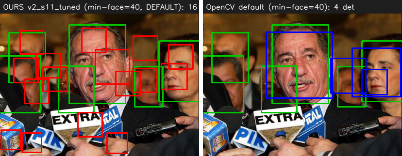
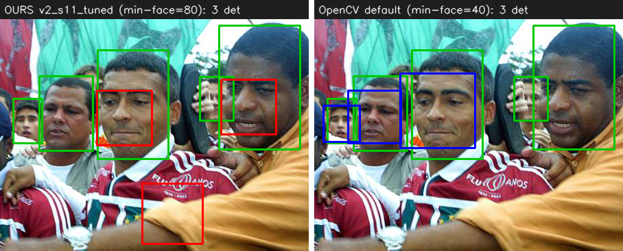
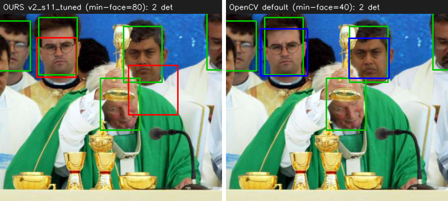
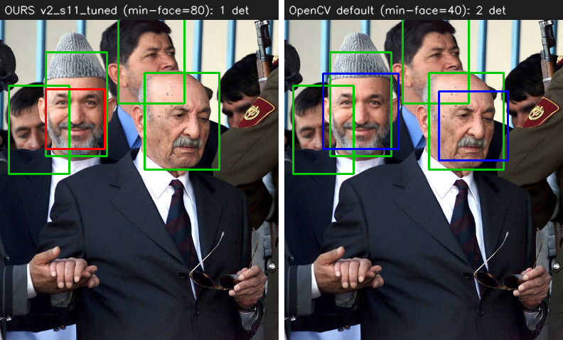

# OpenCV baseline comparison: findings

This document records how our from-scratch Viola-Jones detector compares against the **canonical OpenCV Haar cascades** as an external reference. It is intentionally kept separate from `FINDINGS.md` / `RESULTS.md` (which document our own pipeline): everything here is about *baselining against a third-party implementation*, including the protocol pitfalls that comparison exposes.

## TL;DR

The headline is **not** "OpenCV is better". It is: **each detector wins on the domain it was trained for**, and the benchmark you pick decides the winner.

| Benchmark | Domain | Ours (best) | OpenCV (default) |
|---|---|---|---|
| CBCL patches (`main.py test`) | tight, aligned face crops | **F1 0.661** | **F1 0.000** |
| FDDB, 10 folds (full images, IoU≥0.3) | in-the-wild scenes | AP 0.28 / recall 0.40 | **AP 0.74 / recall 0.75** |

Our detector was trained on aligned, tightly-cropped CelebA/CBCL faces, so it dominates the tight-crop patch benchmark and OpenCV scores zero there. OpenCV's cascade was trained on in-the-wild news photos (the same source family as FDDB), so it dominates full-image in-the-wild detection. Neither benchmark alone is "the" comparison.

## Tooling

Two scripts were added; both are self-documenting and require no network at run time (FDDB is downloaded once, see *Data provenance*).

- `tools/baseline_opencv.py`: runs the bundled OpenCV cascades. `benchmark` reproduces our CBCL patch test; `detect` runs full-image detection and writes annotated PNGs.
- `tools/eval_fddb.py`: runs **both** detectors on FDDB in their native full-image mode and reports IoU-matched AP / recall / precision (+ FDDB-ROC recall at fixed false-positive budgets). Detection runs once per detector; metrics are recomputed cheaply at every requested IoU.

OpenCV ships the cascades inside the `opencv-python` package (`cv2.data.haarcascades`), so nothing is downloaded for them. Tested with OpenCV 4.13.0.

## Part 1: CBCL patch benchmark: why it does **not** transfer to OpenCV

Our `main.py test` scores per-patch face/non-face decisions on the CBCL test set (472 faces + 23,573 non-faces, 24×24). Feeding those same patches to OpenCV via a single-window `detectMultiScale`:

| Cascade | recall | precision | F1 |
|---|---|---|---|
| opencv default | 0.000 | 0.000 | 0.000 |
| opencv alt | 0.000 | 0.000 | 0.000 |
| opencv alt2 | 0.000 | 0.000 | 0.000 |
| **ours (v2_s11_tuned)** | **0.625** | **0.701** | **0.661** |

OpenCV returning **0/472** is not a bug, the same cascade finds 8 faces in `images/people.png`. OpenCV's cascade was trained with the face occupying the *centre* of the window with a context border (forehead/background) around it; its Haar features key off that border contrast. The CBCL crops are extremely tight (face to the edges, no margin), so those border features never fire. This is confirmed by reintroducing fabricated margin around the positive patches:

| Margin around the CBCL face | OpenCV recall (positives) |
|---|---|
| 0% (tight crop, as-is) | 0.0% |
| +40% gray border | 8.7% |
| +60% gray border | 22.7% |

Recall climbs monotonically with context, but the CBCL crops do not carry the surrounding pixels to add it back honestly, so **there is no fair patch-level number for OpenCV**. Use the full-image benchmark instead.

## Part 2: FDDB full-image benchmark (the comparable metric)

FDDB (Face Detection Data Set and Benchmark, UMass) is the canonical Viola-Jones-era benchmark: 2845 images, 5171 faces, annotated as ellipses. Both detectors run in their native multi-scale mode on the same images; detections are matched to ground truth by IoU. The headline below is on **all 10 folds (2845 images, 5171 faces)**; the per-model and sensitivity breakdowns that follow are on **fold 1 (290 images, 515 faces)**, which we verified tracks the 10-fold numbers closely (e.g. our best AP@0.3 is 0.298 on fold 1 vs 0.282 on all folds).

Protocol / honest caveats:
- GT ellipses are converted to their axis-aligned bounding boxes. FDDB ellipses include forehead+chin, so they run a bit taller than a typical detector box: IoU≥0.5 against the bbox is a standard but slightly strict simplification. We report both IoU≥0.3 and IoU≥0.5.
- OpenCV detections come from `detectMultiScale3` (confidence = stage `levelWeight`), `scaleFactor=1.1`, `minNeighbors=2`.
- Different training data is *the point* of a baseline, not a flaw: both detectors are scored identically on the same images.

### Headline (all 10 folds)

| Detector | AP@0.3 | R@0.3 | P@0.3 | AP@0.5 | R@0.5 | P@0.5 |
|---|---|---|---|---|---|---|
| OpenCV `alt` (cv2) | 0.738 | 0.741 | 0.934 | 0.678 | 0.694 | 0.876 |
| OpenCV `default` (cv2) | 0.736 | 0.751 | 0.763 | 0.683 | 0.709 | 0.720 |
| OpenCV `default` (our native port) | 0.724 | 0.740 | 0.655 | 0.624 | 0.658 | 0.582 |
| **ours v2_s11_tuned (min-face 80)** | 0.282 | 0.400 | 0.439 | 0.014 | 0.111 | 0.121 |
| ours v2_s11_tuned (min-face 40) | 0.069 | 0.278 | 0.045 | 0.000 | 0.033 | 0.005 |

FDDB-ROC at scale: OpenCV `default` reaches recall 0.62 at 100 total false positives across all 2845 images and 0.74 at 1000; our best stays at 0.10 / 0.29 over the same budget. The story is identical to fold 1, only with tighter (lower-variance) numbers.

### Our models (fold 1, min-face=40)

| Model | dets | AP@0.3 | recall@0.3 | prec@0.3 | AP@0.5 | recall@0.5 | prec@0.5 |
|---|---|---|---|---|---|---|---|
| celeba_aligned__24_v1_tuned | 3510 | 0.047 | 0.252 | 0.037 | 0.000 | 0.033 | 0.005 |
| celeba_aligned__24_v2_s11 | 3724 | 0.023 | 0.163 | 0.023 | 0.000 | 0.031 | 0.004 |
| **celeba_aligned__24_v2_s11_tuned** | 3252 | **0.073** | **0.272** | 0.043 | 0.001 | 0.033 | 0.005 |
| celeba_aligned+cbcl__19_v2 | 5514 | 0.003 | 0.117 | 0.011 | 0.000 | 0.025 | 0.002 |
| celeba_aligned+cbcl__19_v2_tuned | 5222 | 0.002 | 0.091 | 0.009 | 0.000 | 0.016 | 0.002 |

Best of ours: **celeba_aligned__24_v2_s11_tuned**. The 19×19 models are clearly worse (5000+ detections → more false positives). All of our models emit ~3000–5500 detections for 515 faces (~10–18 false positives per image): the negative-rejection learned from Caltech/CBCL negatives does not generalize to in-the-wild backgrounds.

### OpenCV cascades (fold 1, min-face=40)

| Cascade | dets | AP@0.3 | recall@0.3 | prec@0.3 | AP@0.5 | recall@0.5 | prec@0.5 |
|---|---|---|---|---|---|---|---|
| default | 520 | 0.733 | 0.750 | 0.742 | 0.665 | 0.689 | 0.683 |
| alt | 407 | 0.734 | 0.738 | 0.934 | 0.654 | 0.674 | 0.853 |
| alt2 | 408 | 0.734 | 0.736 | 0.929 | 0.653 | 0.676 | 0.853 |

`alt`/`alt2` are notably cleaner (precision 0.85–0.93, ~27–60 false positives total) at similar recall. FDDB-ROC: OpenCV `default` already reaches recall **0.74 with only 100 total false positives**; every one of our models stays near zero across the whole FP budget.

### Strict vs lenient IoU: the box-convention artifact

Our recall jumps from ~0.03 (IoU≥0.5) to ~0.25–0.45 (IoU≥0.3), while OpenCV barely moves (0.69 → 0.75). Diagnostic on 40 images, per-GT best IoU achieved:

- ours: mean 0.225, mass in the 0.1–0.3 band, only 2/69 reach ≥0.5
- opencv: mean 0.507, 51/69 reach ≥0.5

So our boxes *do* land on faces but systematically tighter than the FDDB ellipse bbox, capping strict-IoU matches. Part of our low score is this convention mismatch (an evaluation artifact), but the dominant problem is the false-positive flood (a real generalization gap).

## Answer to "would other detect flags help our model?": yes, `min-face` a lot

FDDB has almost no tiny faces, so the small pyramid scales only manufacture false positives. Raising `--detect-min-face` (passed as `min_face_size` to `find_faces`) removes those scales. On `celeba_aligned__24_v2_s11_tuned`, full fold 1:

| min-face | dets | AP@0.3 | recall@0.3 | prec@0.3 | AP@0.5 | recall@0.5 | prec@0.5 |
|---|---|---|---|---|---|---|---|
| 40 (default) | 3252 | 0.073 | 0.272 | 0.043 | 0.001 | 0.033 | 0.005 |
| 60 | 706 | 0.299 | **0.454** | 0.331 | 0.006 | 0.076 | 0.055 |
| 80 | 483 | 0.298 | 0.408 | **0.435** | 0.010 | 0.089 | 0.095 |

Going 40→80 **multiplies AP@0.3 by ~4× and precision@0.3 by ~10×, and recall *also* rises**, the larger-scale boxes both stop manufacturing small-scale FPs and localize better against FDDB's taller GT boxes (so weighted-NMS produces cleaner, better-matched boxes). The default of 40 was actively hurting the detector on this dataset. It still trails OpenCV (AP@0.3 ~0.30 vs ~0.73), but the gap shrinks from "broken" to "much weaker". `max-face` made no difference on fold 1 (no faces above 300px). `min-score`/NMS tuning move the operating point but not AP (the AP sweep already integrates over score).

## Figures: our best vs OpenCV

Green = ground truth, red = ours, blue = OpenCV. Files under `images/outputs/opencv_comparison/`.

The false-positive flood at the detector default (min-face=40): 16 detections, mostly spurious, vs OpenCV's 4 clean boxes.



Our best operating point (min-face=80) vs OpenCV default, cleaner, but still misses faces OpenCV catches:





## Interpretation

The gap on FDDB has three contributors, only one of which is "implementation quality":
1. **Domain mismatch**, ours is trained on aligned, frontal CelebA crops; FDDB is in-the-wild (profiles, occlusion, varied lighting). OpenCV's training set is the same in-the-wild news-photo family as FDDB, so FDDB structurally favors it. (Mirror image: the CBCL tight-crop benchmark structurally favors us.)
2. **Negative diversity**, our negatives are Caltech/CBCL patches, not rich real-world scenes, so we emit ~10–18 false positives per FDDB image.
3. **Box convention**, our boxes are tighter than the FDDB ellipse bbox, deflating strict-IoU recall (an evaluation artifact, partly recoverable by relaxing IoU or raising min-face).

Useful as a baseline statement: *on its own tight-crop domain our detector is strong (F1 0.66) and OpenCV cannot even fire; on in-the-wild FDDB the relationship flips and OpenCV is far ahead, though raising min-face recovers a large part of our score.*

## Native port: the OpenCV cascade as a `weights/*.pkl`

The OpenCV cascade can be made to run **inside our own pipeline** as a native model: `tools/convert_opencv_cascade.py` parses the cascade XML and pickles an `OpenCVCascade` object (`opencv_cascade.py`) to `weights/`. It duck-types the `ViolaJones` interface (`classify`, `find_faces`, `base_width/base_height/base_scale/shift`, `save`) so `main.py detect`, `main.py test` and `tools/eval_fddb.py` all work against it, **with no cv2 import at inference** (pure NumPy over our padded integral image). It *reproduces* OpenCV's trained cascade; it does not retrain anything.

The evaluator follows OpenCV's `HaarEvaluator` exactly, in the "scale the image" regime (every pyramid level downsizes the image and runs the base 24×24 window, reducing each window to the unambiguous scale-1 math): `nf = sqrt(winArea·Σx² − (Σx)²)` clamped to ≥1, and each stump compares `Σ wᵢ·rectsumᵢ < threshold·nf` to pick its real-valued leaf, summing leaves per stage against the stage threshold. This differs fundamentally from our own stage math (`vote = Σαᵢhᵢ/Σαᵢ` with binary stumps), so it is a separate class rather than a `ViolaJones` instance.

**Faithfulness, proven.** The converter validates every base-window patch against cv2 itself:

| Cascade | window | stages | stumps | window-level parity vs cv2 |
|---|---|---|---|---|
| default | 24×24 | 25 | 2913 | **3472/3472 (100.00%)** |
| alt | 20×20 | 22 | 2135 | 3471/3472 (99.97%) |
| alt2 | 20×20 | 20 | n/a | **not supported** (depth-2 trees, not stumps) |

`default` and `alt` are axis-aligned stump cascades and port exactly (the single `alt` mismatch is one borderline rounding case). `alt2` and `alt_tree` use CART trees (multiple internal nodes per weak classifier), which `OpenCVCascade` does not implement, the converter rejects them with a clear error.

**Detection-level behaviour.** Window-level math is exact, but end-to-end detection differs slightly from cv2's `detectMultiScale` because cv2 confirms/groups via `minNeighbors` (requires ≥N overlapping windows, which suppresses isolated false positives) whereas our pipeline emits raw windows and leaves grouping to `non_maximum_supression`. The native `default` on FDDB all 10 folds (2845 images, baked-in growth=1.1, shift=2):

| Detector | AP@0.3 | recall@0.3 | prec@0.3 | AP@0.5 | recall@0.5 | prec@0.5 |
|---|---|---|---|---|---|---|
| opencv:default (cv2, minNeighbors=2) | 0.736 | 0.751 | 0.763 | 0.683 | 0.709 | 0.720 |
| **opencv_default.pkl (native, our NMS)** | 0.724 | 0.740 | 0.655 | 0.624 | 0.658 | 0.582 |

The native port tracks cv2 closely (AP@0.3 0.724 vs 0.736 ≈ 98%, recall 0.740 vs 0.751); the residual gap is grouping (NMS vs `minNeighbors`, which costs some precision) + pyramid resampling, not the cascade math. For cv2-identical numbers (with `minNeighbors`), use `tools/baseline_opencv.py` / the cv2 path in `tools/eval_fddb.py`. Detection false positives in `main.py detect` clean up with `--detect-min-score` (the native model's raw scores run ~70–330, so e.g. `--detect-min-score 150` keeps the confident boxes).

Build and use:

```bash
python tools/convert_opencv_cascade.py --cascade default     # -> weights/24/opencv_default.pkl
python tools/convert_opencv_cascade.py --cascade alt         # -> weights/20/opencv_alt.pkl
python main.py detect --weights-path weights/24/opencv_default.pkl --detect-min-score 150
python main.py test   --weights-path weights/24/opencv_default.pkl --data-dir data/24_cbcl   # ~0 on tight crops, as expected
```

## Reproduce

```bash
# Part 1: patch benchmark (OpenCV scores ~0 by design; see Part 1)
python tools/baseline_opencv.py benchmark --data-dir data/24_cbcl --cascade default alt alt2
python main.py test --weights-path weights/24/celeba_aligned__24_v2_s11_tuned.pkl --data-dir data/24_celeba_aligned

# Part 2: FDDB, both detectors, two IoU thresholds in one pass (~3-4 min)
python tools/eval_fddb.py --weights weights/24/celeba_aligned__24_v2_s11_tuned.pkl --cascade default --folds 1 --iou 0.3,0.5

# flag sensitivity (answer to the min-face question)
python tools/eval_fddb.py --weights weights/24/celeba_aligned__24_v2_s11_tuned.pkl --skip-opencv --folds 1 --min-face 80 --iou 0.3,0.5

# full benchmark (all 10 folds, ~30 min for our detector)
python tools/eval_fddb.py --weights weights/24/celeba_aligned__24_v2_s11_tuned.pkl --cascade default --folds 1,2,3,4,5,6,7,8,9,10 --iou 0.3,0.5
```

## Data provenance

The official FDDB host (`vis-www.cs.umass.edu`) was DNS-unreachable at the time of writing (a recurring outage). FDDB was instead pulled from the HuggingFace mirror **`tahirishaq10/fddb_dataset`**, which carries the original tarballs verbatim (`originalPics.tar.gz`, `FDDB-folds.tgz`). Extracted to `data/fddb/` (gitignored):

```
data/fddb/originalPics/<year>/...                  # images
data/fddb/FDDB-folds/FDDB-fold-NN-ellipseList.txt  # ellipse annotations
```
