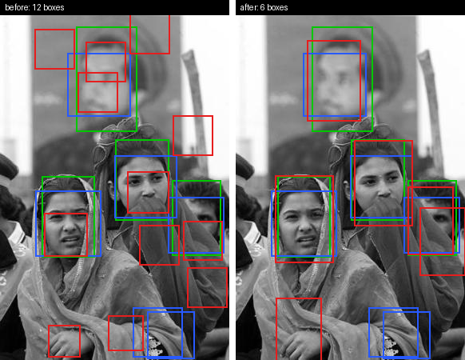
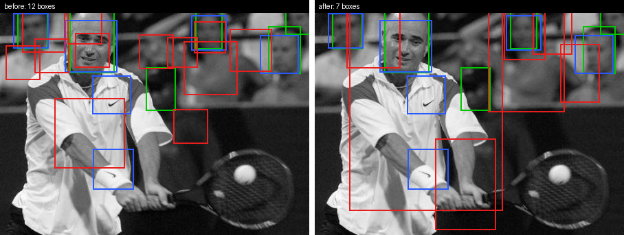

# OpenCV baseline comparison: findings

This document records how our from-scratch Viola-Jones detector compares against the **canonical OpenCV Haar cascades** as an external reference. It is intentionally kept separate from `FINDINGS.md` / `RESULTS.md` (which document our own pipeline): everything here is about *baselining against a third-party implementation*, including the protocol pitfalls that comparison exposes.

The FDDB part was rewritten at the end of the project. Its first version reported AP@0.3 ≈ 0.07 for our best model and blamed a "false-positive flood" from out-of-domain negatives; a post-mortem showed that most of that gap came from two problems on our side that had nothing to do with training (an evaluation box-convention mismatch and an inference pyramid bug). Both are fixed, every number below was regenerated by `tools/reeval.sh` ([results_reeval.txt](../results_reeval.txt)), and the earlier conclusion that `--detect-min-face 80` helps was an artifact of the first problem.

## TL;DR

On in-the-wild FDDB, OpenCV's pretrained cascade is still clearly ahead of our best model, but by much less than first measured:

| FDDB folds 2-10 (2555 images, 4656 faces) | AP@0.3 | AP@0.5 | recall@0.3 | precision@0.3 |
| :-- | :-: | :-: | :-: | :-: |
| Ours ⭐, as first evaluated (feature-scaled pyramid, raw boxes) | 0.069 | 0.000 | 0.279 | 0.045 |
| **Ours ⭐, after the two fixes (no retraining)** | **0.589** | **0.471** | 0.716 | 0.300 |
| OpenCV `default` (cv2), same protocol | 0.737 | 0.726 | 0.753 | 0.767 |

⭐ = `weights/24/celeba_aligned__24_v2_s11_tuned.pkl`. The gap had three causes, measured in [Part 2](#what-was-wrong-three-causes-measured):

1. **Box convention (evaluation).** Our positives are tight eyes-to-mouth crops, FDDB's boxes go from forehead to chin, so a perfect detection of ours scored IoU ≈ 0.33 and most correct detections were counted as false positives. Fixed by a per-detector box transform fitted on held-out data.
2. **Feature-scaled pyramid (inference bug).** `find_faces` scaled the Haar rectangles with `int()` truncation instead of downsizing the image, which let ~3.5× more background through. Fixed by scaling the image, as OpenCV does.
3. **The trained cascade (real, needs retraining).** With 1 and 2 fixed, our recall is close to OpenCV's but our precision is not: the cascade lets ~18× more background windows through, because its negatives were object photos and CBCL patches, not scenes with people. What to change is in [RETRAINING.md](RETRAINING.md).

On the CBCL tight-crop patch benchmark the relationship is reversed (ours F1 0.661, OpenCV 0.000) because OpenCV's cascades need a context margin those crops do not have ([Part 1](#part-1-cbcl-patch-benchmark-why-it-does-not-transfer-to-opencv)).

## Tooling

Every script is self-documenting and needs no network at run time (FDDB is downloaded once, see *Data provenance*).

- `tools/baseline_opencv.py`: runs the bundled OpenCV cascades. `benchmark` reproduces our CBCL patch test; `detect` runs full-image detection and writes annotated PNGs.
- `tools/eval_fddb.py`: runs **both** detectors on FDDB in their native full-image mode and reports IoU-matched AP / recall / precision (+ FDDB-ROC recall at fixed false-positive budgets). `--box-fit-folds` fits each detector's box transform on held-out folds and reports raw and `+box` rows; `--save-box-transform` stores ours in the `.pkl`.
- `tools/diagnose_fddb_windows.py`: window-level diagnostic (background windows passing the cascade, per-stage rejection) for ours and the native OpenCV port.
- `tools/draw_fddb_comparison.py`: the before/after figures below.
- `tools/reeval.sh`: regenerates every number in this document and the README.

OpenCV ships the cascades inside the `opencv-python` package (`cv2.data.haarcascades`), so nothing is downloaded for them. Tested with OpenCV 4.13.0.

## Part 1: CBCL patch benchmark: why it does **not** transfer to OpenCV

Our `main.py test` scores per-patch face/non-face decisions on the CBCL test set (472 faces + 23,573 non-faces, 24×24). Feeding those same patches to OpenCV via a single-window `detectMultiScale`:

| Cascade | recall | precision | F1 |
|---|---|---|---|
| opencv default | 0.000 | 0.000 | 0.000 |
| opencv alt | 0.000 | 0.000 | 0.000 |
| opencv alt2 | 0.000 | 0.000 | 0.000 |
| **ours (v2_s11_tuned)** | **0.625** | **0.701** | **0.661** |

OpenCV returning **0/472** is not a bug, the same cascade finds 8 faces in `images/people.png`. OpenCV's cascade was trained with the face occupying the *centre* of the window with a context border (forehead/background) around it; its Haar features key off that border contrast. The CBCL crops are extremely tight (face to the edges, no margin), so those border features never fire. This is confirmed by reintroducing fabricated margin around the positive patches:

| Margin around the CBCL face | OpenCV recall (positives) |
|---|---|
| 0% (tight crop, as-is) | 0.0% |
| +40% gray border | 8.7% |
| +60% gray border | 22.7% |

Recall climbs monotonically with context, but the CBCL crops do not carry the surrounding pixels to add it back honestly, so **there is no fair patch-level number for OpenCV**. Use the full-image benchmark instead.

## Part 2: FDDB full-image benchmark (the comparable metric)

FDDB (Face Detection Data Set and Benchmark, UMass) is the canonical Viola-Jones-era benchmark: 2845 images, 5171 faces in 10 folds, annotated as ellipses. Both detectors run in their native multi-scale mode on the same images and detections are matched to ground truth by IoU.

### Protocol

- **Folds.** Fold 1 (290 images) is used only to fit box transforms. Every reported number is on the 9 held-out folds 2-10 (2555 images, 4656 faces).
- **Ground truth.** Ellipses are converted to their axis-aligned bounding boxes. Reported at IoU ≥ 0.5 and the more lenient 0.3.
- **Box convention.** A detector's box follows the crop convention of its training positives. For each detector we fit one transform `(sw, sh, dcx, dcy)` on fold 1 (the per-coordinate median that maps each detection to the GT box it overlaps most, over detections with IoU ≥ 0.2) and report both the raw rows and the `+box` rows. Fitted transforms: ours `sw=1.43 sh=2.14 dcy=-0.23` (our box is much smaller than FDDB's and centred lower); OpenCV `default` `sw=0.90 sh=1.36 dcy=-0.07` (its boxes already include a margin). The `+box` rows are the fair comparison.
- **Detectors.** OpenCV: `detectMultiScale3`, `scaleFactor=1.1`, `minNeighbors=2`, confidence = stage `levelWeight`. Ours: image pyramid (growth 1.25, step ≈ 2 px), weighted hybrid NMS at 0.3, score = summed stage margins. `min-face 40` for both.
- Different training data is *the point* of a baseline, not a flaw: both detectors are scored identically on the same images.

### Headline (folds 2-10)

| Detector | AP@0.5 | R@0.5 | P@0.5 | AP@0.3 | R@0.3 | P@0.3 | R@0.3, 100 FP |
| :-- | :-: | :-: | :-: | :-: | :-: | :-: | :-: |
| OpenCV `alt` (cv2) +box | 0.731 | 0.734 | 0.926 | 0.739 | 0.742 | 0.936 | 0.716 |
| OpenCV `default` (cv2) +box | 0.726 | 0.742 | 0.756 | 0.737 | 0.753 | 0.767 | 0.623 |
| OpenCV `default` (our native port) +box | 0.703 | 0.720 | 0.637 | 0.730 | 0.745 | 0.659 | 0.641 |
| **Ours 24×24 CelebA v2 ⭐ +box** | **0.471** | 0.596 | 0.250 | **0.589** | 0.716 | 0.300 | 0.297 |
| Ours 24×24 CBCL smoke +box | 0.503 | 0.575 | 0.513 | 0.561 | 0.629 | 0.561 | 0.319 |
| Ours 19×19 CelebA<sub>aligned</sub>+CBCL v2 +box | 0.483 | 0.600 | 0.291 | 0.578 | 0.698 | 0.338 | 0.297 |
| OpenCV `default` (cv2), raw boxes | 0.686 | 0.711 | 0.724 | 0.736 | 0.752 | 0.766 | 0.623 |
| Ours ⭐, raw boxes | 0.001 | 0.037 | 0.015 | 0.160 | 0.365 | 0.153 | 0.035 |

Recall at 0.3 is within a few points of OpenCV; precision is where we lose. All our models and their FDDB scores are in the per-model table below.

### What was wrong: three causes, measured

Same model (⭐), same folds, switching one fix at a time:

| Pyramid | Boxes | AP@0.3 | AP@0.5 | R@0.3 | P@0.3 |
| :-- | :-- | :-: | :-: | :-: | :-: |
| features (legacy) | raw | 0.069 | 0.000 | 0.279 | 0.045 |
| features (legacy) | face (+box) | 0.461 | 0.285 | 0.716 | 0.116 |
| image | raw | 0.160 | 0.001 | 0.365 | 0.153 |
| **image** | **face (+box)** | **0.589** | **0.471** | 0.716 | 0.300 |
| OpenCV `default` | face (+box) | 0.737 | 0.726 | 0.753 | 0.767 |

**1. Box convention (the largest term, an evaluation artifact).** Every model in this repo was trained on tight eyes-to-mouth crops (the CBCL framing, which CelebA was aligned to), so every detection box covers eyes to mouth. FDDB's box (the bounding box of an ellipse from forehead to chin) is 1.43× wider and 2.14× taller, centred 23% of our box height higher. A perfectly centred detection therefore reaches IoU ≈ 1/(1.43·2.14) ≈ 0.33: it can never count at IoU ≥ 0.5 and is a coin flip at 0.3. Mapping the boxes alone takes recall@0.3 from 0.279 to 0.716: the detector was already finding most faces, they were just scored as false positives. OpenCV's boxes need a much smaller correction (sw ≈ 0.9, sh ≈ 1.4), which moves the cv2 cascades' AP@0.5 by 0.04 to 0.05 and their AP@0.3 by less than 0.01.

**2. Feature-scaled pyramid (an inference bug).** `find_faces` used to keep the image at full resolution and scale every Haar rectangle by the pyramid scale `s` with `int()` truncation. The rectangles of one feature then have unequal areas (a 4-px-wide pair at `s = 1.25` becomes 5 + 6 px), so each feature picks up a mean-brightness term the trained stump never saw, and windows are evaluated at a finer resolution than the bilinearly downsized training patches. The fix is the default `pyramid="image"`: downsize the image with the same PIL bilinear filter used for training and run the native 24×24 window, as OpenCV does. On fold 1 the background windows that pass the whole cascade drop from 1.55e-03 to 4.50e-04 per window (165.0 → 47.0 per image before NMS), and on folds 2-10 precision at full recall goes from 0.116 to 0.300. The CBCL benchmark never exposed this because it classifies patches at scale 1, where both modes are identical.

**3. The trained cascade (the real, residual gap).** Under identical inference and evaluation, our cascade still lets 4.50e-04 background windows through per window against 2.47e-05 for OpenCV (18× more; 47.0 vs 1.3 per image before NMS). Its deep stages, which hold most of its stumps, reject only ~10% of the real-world windows that reach them, because they were trained against Caltech-256 object photos and CBCL non-faces, not scenes with people. The figures below show what survives: bodies, clothes, hands. This needs retraining; [RETRAINING.md](RETRAINING.md) has the per-stage numbers and the ranked list of changes.

### Per-model (folds 2-10, face boxes, tuned thresholds)

| Model (`_tuned`) | Res | CBCL F1 | FDDB AP@0.5 | AP@0.3 | R@0.3 | P@0.3 |
| :-- | :-: | :-: | :-: | :-: | :-: | :-: |
| CBCL v1 | 19×19 | 0.634 | 0.459 | 0.526 | 0.622 | 0.465 |
| CBCL v2 | 19×19 | 0.658 | 0.475 | 0.539 | 0.632 | 0.449 |
| CelebA<sub>aligned</sub> v1 | 19×19 | 0.542 | 0.310 | 0.470 | 0.679 | 0.215 |
| CelebA<sub>aligned</sub> v2 | 19×19 | 0.550 | 0.362 | 0.517 | 0.693 | 0.233 |
| CelebA<sub>aligned</sub> filtered v3 | 19×19 | 0.603 | 0.439 | 0.496 | 0.568 | 0.557 |
| CelebA<sub>aligned</sub>+CBCL v1 | 19×19 | 0.639 | 0.472 | 0.566 | 0.689 | 0.351 |
| CelebA<sub>aligned</sub>+CBCL v2 | 19×19 | 0.661 | 0.483 | 0.578 | 0.698 | 0.338 |
| CBCL smoke | 24×24 | 0.660 | 0.503 | 0.561 | 0.629 | 0.561 |
| CelebA<sub>aligned</sub> v1 | 24×24 | 0.629 | 0.469 | 0.586 | 0.716 | 0.319 |
| CelebA<sub>aligned</sub> v2 ⭐ | 24×24 | 0.661 | 0.471 | 0.589 | 0.716 | 0.300 |

### `--detect-min-face`, revisited

The first version of this document recommended `--detect-min-face 80` because it quadrupled AP@0.3. With face boxes the effect reverses:

| min-face | boxes | AP@0.3 | AP@0.5 | R@0.3 | P@0.3 |
| :-: | :-- | :-: | :-: | :-: | :-: |
| 40 | raw | 0.160 | 0.001 | 0.365 | 0.153 |
| 80 | raw | 0.303 | 0.025 | 0.443 | 0.394 |
| **40** | **face** | **0.589** | **0.471** | 0.716 | 0.300 |
| 80 | face | 0.425 | 0.321 | 0.509 | 0.453 |

With raw boxes, larger windows simply overlap FDDB's tall boxes more, which looked like a win. With face boxes, min-face 80 only drops every face under ~110 px. Keep the default unless you know the image has no small faces.

## Figures: before and after the fixes

Green = ground truth, red = ours (⭐), blue = OpenCV `default`. Left panel: our detector as first evaluated (feature-scaled pyramid, raw boxes); right panel: after the fixes. OpenCV and ground truth are identical in both panels. All three images are from held-out folds. Regenerate with `tools/draw_fddb_comparison.py`.

A single portrait: 13 boxes (one tight box on the face, 12 false positives) become one box that matches the ground truth. OpenCV also fires on the medal.


Four faces. Before, three of them are hit only by tight boxes that FDDB scores as misses, among a scatter of false positives; after, all four get face-sized boxes, with one false positive on the scarf and an offset duplicate left. OpenCV also finds all four, with two false positives on the hands.



The residual problem: bodies and clothes pass the cascade (large red boxes on the shirt and arm) because the negatives it was trained on never contained them.



## Native port: the OpenCV cascade as a `weights/*.pkl`

The OpenCV cascade can be made to run **inside our own pipeline** as a native model: `tools/convert_opencv_cascade.py` parses the cascade XML and pickles an `OpenCVCascade` object (`opencv_cascade.py`) to `weights/`. It duck-types the `ViolaJones` interface (`classify`, `find_faces`, `base_width/base_height/base_scale/shift`, `save`) so `main.py detect`, `main.py test` and `tools/eval_fddb.py` all work against it, **with no cv2 import at inference** (pure NumPy over our padded integral image). It *reproduces* OpenCV's trained cascade; it does not retrain anything.

The evaluator follows OpenCV's `HaarEvaluator` exactly, in the "scale the image" regime (every pyramid level downsizes the image and runs the base 24×24 window, reducing each window to the unambiguous scale-1 math): `nf = sqrt(winArea·Σx² − (Σx)²)` clamped to ≥1, and each stump compares `Σ wᵢ·rectsumᵢ < threshold·nf` to pick its real-valued leaf, summing leaves per stage against the stage threshold. This differs fundamentally from our own stage math (`vote = Σαᵢhᵢ/Σαᵢ` with binary stumps), so it is a separate class rather than a `ViolaJones` instance.

**Faithfulness, proven.** The converter validates every base-window patch against cv2 itself:

| Cascade | window | stages | stumps | window-level parity vs cv2 |
|---|---|---|---|---|
| default | 24×24 | 25 | 2913 | **3472/3472 (100.00%)** |
| alt | 20×20 | 22 | 2135 | 3471/3472 (99.97%) |
| alt2 | 20×20 | 20 | n/a | **not supported** (depth-2 trees, not stumps) |

`default` and `alt` are axis-aligned stump cascades and port exactly (the single `alt` mismatch is one borderline rounding case). `alt2` and `alt_tree` use CART trees (multiple internal nodes per weak classifier), which `OpenCVCascade` does not implement, the converter rejects them with a clear error.

**Detection-level behaviour.** Window-level math is exact, but end-to-end detection differs slightly from cv2's `detectMultiScale` because cv2 confirms/groups via `minNeighbors` (requires ≥N overlapping windows, which suppresses isolated false positives) whereas our pipeline emits raw windows and leaves grouping to `non_maximum_supression`. On FDDB folds 2-10 (baked-in growth=1.1, shift=2):

| Detector | AP@0.3 | recall@0.3 | prec@0.3 | AP@0.5 | recall@0.5 | prec@0.5 |
|---|---|---|---|---|---|---|
| opencv:default (cv2, minNeighbors=2) | 0.736 | 0.752 | 0.766 | 0.686 | 0.711 | 0.724 |
| **opencv_default.pkl (native, our NMS)** | 0.725 | 0.741 | 0.655 | 0.627 | 0.660 | 0.583 |
| opencv:default (cv2) +box | 0.737 | 0.753 | 0.767 | 0.726 | 0.742 | 0.756 |
| **opencv_default.pkl (native) +box** | 0.730 | 0.745 | 0.659 | 0.703 | 0.720 | 0.637 |

The native port tracks cv2 closely (AP@0.3 0.725 vs 0.736); the residual gap is grouping (NMS vs `minNeighbors`, which costs some precision) + pyramid resampling, not the cascade math. For cv2-identical numbers (with `minNeighbors`), use `tools/baseline_opencv.py` / the cv2 path in `tools/eval_fddb.py`. Detection false positives in `main.py detect` clean up with `--detect-min-score` (the native model's raw scores run ~70–330, so e.g. `--detect-min-score 150` keeps the confident boxes).

Build and use:

```bash
python tools/convert_opencv_cascade.py --cascade default     # -> weights/24/opencv_default.pkl
python tools/convert_opencv_cascade.py --cascade alt         # -> weights/20/opencv_alt.pkl
python main.py detect --weights-path weights/24/opencv_default.pkl --detect-min-score 150
python main.py test   --weights-path weights/24/opencv_default.pkl --data-dir data/24_cbcl   # ~0 on tight crops, as expected
```

## Reproduce

```bash
# Part 1: patch benchmark (OpenCV scores ~0 by design; see Part 1)
python tools/baseline_opencv.py benchmark --data-dir data/24_cbcl --cascade default alt alt2
python main.py test --weights-path weights/24/celeba_aligned__24_v2_s11_tuned.pkl --data-dir data/24_celeba_aligned

# Part 2: headline, boxes fitted on fold 1, metrics on folds 2-10 (~10 min)
python tools/eval_fddb.py --weights weights/24/celeba_aligned__24_v2_s11_tuned.pkl --cascade default \
    --box-fit-folds 1 --folds 2,3,4,5,6,7,8,9,10 --iou 0.3,0.5

# the pre-fix numbers (legacy pyramid)
python tools/eval_fddb.py --weights weights/24/celeba_aligned__24_v2_s11_tuned.pkl --skip-opencv --pyramid features \
    --box-fit-folds 1 --folds 2,3,4,5,6,7,8,9,10 --iou 0.3,0.5

# window-level diagnostic (background FPR per window, per-stage rejection)
python tools/diagnose_fddb_windows.py --folds 1 \
    --weights weights/24/celeba_aligned__24_v2_s11_tuned.pkl weights/24/opencv_default.pkl

# everything (all models, ~2 h)
tools/reeval.sh
```

## Data provenance

The official FDDB host (`vis-www.cs.umass.edu`) was DNS-unreachable at the time of writing (a recurring outage). FDDB was instead pulled from the HuggingFace mirror **`tahirishaq10/fddb_dataset`**, which carries the original tarballs verbatim (`originalPics.tar.gz`, `FDDB-folds.tgz`). FDDB is not shipped with the repo (`data/` is gitignored); to get it (~580 MB download):

```bash
mkdir -p data/fddb/originalPics && cd data/fddb
python -c "from huggingface_hub import hf_hub_download as d; [d('tahirishaq10/fddb_dataset', f, repo_type='dataset', local_dir='.') for f in ('originalPics.tar.gz', 'FDDB-folds.tgz')]"
tar -xzf originalPics.tar.gz -C originalPics && tar -xzf FDDB-folds.tgz && cd ../..
```

Resulting layout:

```
data/fddb/originalPics/<year>/...                  # images
data/fddb/FDDB-folds/FDDB-fold-NN-ellipseList.txt  # ellipse annotations
```

